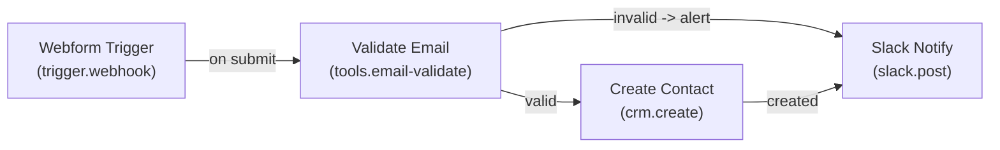

# Demo: Lead Capture to CRM

## Metadata
- **owner**: Team Automation
- **created**: 2025-01-15
- **description**: Collects webform leads, validates email, creates contact in CRM, sends Slack alert.

## Diagram

## Modules
| ID | Name | Type | Notes |
|---:|------|------|-------|
| 1 | Webform Trigger | trigger.webhook | Public webhook; rate-limited. |
| 2 | Validate Email | tools.email-validate | Reject disposable domains. |
| 3 | Create Contact | crm.create | Upsert by email. |
| 4 | Slack Notify | slack.post | Post to #sales-leads. |

## Connections
- 1 → 2 (on submit)
- 2 → 3 (valid)
- 2 → 4 (invalid -> alert)
- 3 → 4 (created)